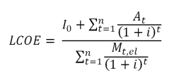

## Behauptung:
>„In Freigericht weht gar nicht genug Wind. Potenzielle Betreiber sind nur auf die Fördergelder für die Anlagen aus.“

## Bedeutung: 
Die für die in Freigericht ausgewiesene Windvorrangfläche zu erwartenden Windgeschwindigkeiten sind zu gering, um einen ausreichenden Stromertrag für einen ökonomisch sinnvollen Betrieb der Anlagen zu rechtfertigen und daher den ökologischen Natureingrifft zu rechtfertigen. Das zu erwartende Defizit wird von möglichen Windparkbetreibern über Fördergelder ausgeglichen und die eigentlich schadhafte Investition dadurch schöngerechnet. 

## Prüfung (vereinfacht): 

**Die Behauptung hält einer Prüfung der Gestehungskosten nicht stand.** Diese setzen sämtliche Kosten einer Energietechnologie (Investition, Zinsen, Betrieb) ins Verhältnis zu dem von ihr erzeugten Stromertrag. Vergleicht man die Gestehungskosten, stellt Onshore-Windenergie aktuell – nach Solarenergie (ohne Speicher) – **die zweitgünstigste Erzeugungstechnologie dar.**

Für die in Freigericht zu erwartende Windgeschwindigkeit ergeben sich Gestehungskosten von voraussichtlich 4,94 – 7,65 €cent/kWh. Diese liegen im Mittleren Bereich für Onshore-Anlagen. Ihre Wirtschaftlichkeit ist damit nicht nur besser als die für konventionelle Kraftwerke, Biomasse und Biogas, sondern auch als jene für Offshore-Windparks. Letztere liefern zwar bessere Winderträge, diesen stehen aber (aufgrund der Hochsee-Standorte) auch wesentlich höhere Installations- und Betriebskosten gegenüber. <a href="https://www.ise.fraunhofer.de/content/dam/ise/de/documents/publications/studies/DE2021_ISE_Studie_Stromgestehungskosten_Erneuerbare_Energien.pdf" target="_blank">Quelle: www.ise.fraunhofer.de</a>

Strompreise, die durch die EEG-Umlage verzerrt werden könnten, spielen für diesen Vergleich keine Rolle, da die Kosten sich auf den Stromertrag selbst beziehen. Eventuelle Fördergelder spiegeln sich über die Verzinsung der Investitionskosten wider und sind damit in den abgebildeten Kostenbereichen berücksichtig. (Die jeweiligen Obergrenzen gehen als (unter anderem) von schlechten Zinsen/keiner Förderung aus.

## Prüfung (ausführlich): 

Die Kosten verschiedener Energieformen lassen sich der jüngsten Studie des Frauenhofer Institituts zu diesem Thema entnehmen. Ebenso zeigt diese die Abhängigkeit der Wirtschaftlichkeit von Windkraftanlagen von der Windgeschwindigkeit ihres Standortes auf. [1] 
Bezogen auf die Windgeschwindigkeit hält sich eisern das Gerücht, dass die Errichtung von Windkraftanlagen erst bei Geschwindigkeiten von mehr als 10 m/s auf Nabenhöhe (130 m) rentabel sei, da die Energieerträge bei niedrigeren Geschwindigkeiten zu gering wären. Derartige Windgeschwindigkeiten lassen sich jedoch – wenn überhaupt – nur an sehr guten Offshore-Standorten erreichen. Selbst Geschwindigkeiten von mehr als 7 m/s sind nur in Küstennähe zu erwarten. [1, Tabelle 3] Diese Aussage steht daher im Widerspruch zu den Gestehungskosten, die für Offshore-Anlagen deutlich höher ausfallen als für Onshore-Anlagen. [1, Abbildung 1] Der Grund hierfür ist, dass den hohen Volllast-Betriebsstunden von Offshore-Anlagen (bis zu 4500 h/a) wesentlich höhere, spezifische Anlagenkosten (3.000 – 4.000 €/kW) für Installation und Betrieb auf hoher See gegenüberstehen. Onshore-Anlagen liefern zwar nur 1800 – 4000 h/a Vollastbetrieb, kommen aber mit wesentlich geringeren spezifischen Anlagekosten (1.200 – 2.000 €/kW) aus. [1, Tabelle 1]

Die zu erwartende Windgeschwindigkeit auf Nabenhöhe liegt in der Freigerichter Windvorrangfläche mit 5,75 – 6 m/s [2] tatsächlich eher am unteren Ende der in der ISE-Studie betrachteten Parameter von 5,5 – 10,3 m/s für Windenergieanlagen insgesamt, bezogen auf Onshore-Anlagen (5,5 – 7,8 m/s) eher im unteren Mittelfeld. [1, Tabelle 3]

| Windenergieanlage (2 - 5 MW) | Windgeschwindigkeit auf 120m Nabenhöhe [m/s] | Wind-Volllaststunden [h] | Stromerzeugung pro 1 kW [kWh/a] | 
| ----------- | ----------- | ----------- | ----------- |
| Onshore: Binnenland Deutschland | 5,5 | 1800 | 1800 |
| Onshore: Norddeutschland |6,4 |2500 |2500 |
| Onshore: Küstennahe und windreiche Standorte Deutschland |7,8|3200|3200|
| Offshore: geringe Entfernung von Küste |7,8|3200|3200|
| Offshore: mittlere Entfernung von Küste |8,7|3600|3600|
| Offshore: sehr gute Standorte |10,3|4500|4500|

**<a href="https://www.ise.fraunhofer.de/content/dam/ise/de/documents/publications/studies/DE2021_ISE_Studie_Stromgestehungskosten_Erneuerbare_Energien.pdf" target="_blank">Quelle: www.ise.fraunhofer.de</a>**

Anhand der Tabellenwerte lassen sich die zu erwartenden Wind-Vollaststunden für die Freigerichter Anlagen berechnen. Überträgt man die Tabellenwerte für ein Bestimmtheitsmaß von 1 auf ein Polynom 3. Grades, ergibt sich für die Vollaststunden die Funktion f(x) = 23,679x³ - 578,66x² + 5135,1x + 12876 mit der Windgeschwindigkeit als x. Angewendet auf die o.g. Freigerichter Windgeschwindigkeit ergeben sich damit abgerundet 2000 – 2200 h/a in Vollast-Betrieb. 

Hieraus ergeben sich für eine Windkraft-Nutzung in Neuses folgende Gestehungskosten:

| Standort-Windgeschwindigkeit	| Gestehungskosten  Minimum (1) | Gestehungskosten  Maximum (2) |
| ----------- | ----------- | ----------- |
|5,75 m/s|	5,35 € Cent/kWh	|7,65 € Cent/kWh|
|6 m/s	|4,94 € Cent/KWh|	7,03 € Cent/kWh|

Die Gestehungskosten für die Freigerichter Windkraftanlagen lägen damit selbst im schlechtesten Szenario (7,65 €cent/kWh) auf Höhe der Mindestkosten für konventionelle Kraftwerke (ca. 7,9 €cent/kWh bei GuD) bzw. vermeintlich geeigneterer Offshore-Standorte (7,23 – 12.13 €cent/kWh).
Hierbei ist zu ergänzen, dass die mit 6 m/s ausgewiesene Windvorrangfläche wahrscheinlich lediglich genug Platz für ein Windrad bietet. Weitere Anlagen würden also auf Flächen mit 5,75 m/s stehen. Insgesamt wirken sich jedoch die Lebensdauer und die (bislang nicht genau bekannten) Investitionskosten sehr viel stärker auf die Wirtschaftlichkeit der Anlagen aus als der konkrete Standort im Neuseser Wald und dessen Windgeschwindigkeit. Die Investitionskosten wiederum hängen u.a. stark von der Anzahl und Dimensionierung der Windkraftanlagen ab, auf deren Gesamtleistung sich dann die entstehenden Fixkosten (Genehmigung, Erschließung) verteilen. Es ist auch zu beachten, dass größere ökologische Eingriffe mit höheren Investitionskosten verbunden sind (mehr Rodungen, mehr Flächenebnung, ggf. zusätzliche Genehmigungsverfahren), weshalb deren Invasivität auch aus Investorensicht soweit möglich zu begrenzen ist. Der Bau von wenigeren, dafür größeren und damit leistungsfähigeren Anlagen, ist daher sowohl ökonomisch als auch ökologisch der sinnvollste Ansatz.

Berechnung für 25 Jahre Betriebsdauer ([1], Seite 37):

<table cellspacing="0" cellpadding="0">
	  <tbody>
	    <tr>
	      <th scope="col"><strong>Formel</strong></th>
	      <th scope="col"><strong>Legende</strong></th>
        </tr>
	    <tr>
	      <td> Kapitalwertmethode</td>
	      <td>LCOE = Gestehungskosten 
	            I0 = Investitionskosten   (CAPEX) 
	            i = WACC real 
	            t = Jahr der Nutzungsperiode (1 – n) 
	            n = wirtschaftliche Nutzungsdauer in   Jahren 
	            At = Summe der Betriebskosten (OPEX fix   + OPEX var) 
          Mt, el = Summe des Stromertrags</td>
        </tr>
      </tbody>
</table>

**<a href="https://www.ise.fraunhofer.de/content/dam/ise/de/documents/publications/studies/DE2021_ISE_Studie_Stromgestehungskosten_Erneuerbare_Energien.pdf" target="_blank">Quelle: www.ise.fraunhofer.de</a>**

Die Anzahl und Dimensionierung der Windkraftanlagen wurden in der Berechnung nicht explizit berücksichtigt. Da diese Größe als Faktor gleichermaßen sowohl in die Parameter I0 (Investitionskosten), At (Betriebskosten) und Mt,el (Stromertrag) einfließt, lässt sie sich aus der Gleichung herauskürzen. Deren Betrachtung ist stattdessen in der Spanne für die Investitionskosten I0 (CAPEX) enthalten, da diese davon maßgeblich beeinflusst werden.

<table>
  <tbody>
    <tr>
      <th colspan="3" scope="col"><b>Parameter</b></th>
    </tr>
    <tr>
      <td rowspan="2">I0 (CAPEX)</td>
      <td>Minimum</td>
      <td>1.400 €/kW</td>
    </tr>
    <tr>
      <td>Maximum</td>
      <td>2.000 €/kW</td>
    </tr>
    <tr>
      <td rowspan="2">M (Stromertrag)</td>
      <td>bei 5,75 m/s</td>
      <td>2.000 h/a Volllast = 2.000 kWh/(kW * a)</td>
    </tr>
    <tr>
      <td>bei 6 m/s</td>
      <td>2.200 h/a Volllast = 2.200 kWh/(kW * a)</td>
    </tr>
    <tr>
      <td rowspan="3">At (OPEX)</td>
      <td>fix</td>
      <td>20 €/(kW * a)</td>
    </tr>
    <tr>
      <td>var min</td>
      <td>0,008 €/kWh * 2.000 h/a = 16 €/(kW *a)</td>
    </tr>
    <tr>
      <td>var max</td>
      <td>0,008 €/kWh * 2.200 h/a = 17,6/(kW * a)</td>
    </tr>
    <tr>
      <td rowspan="2">i (WACC real)</td>
      <td>Minimum</td>
      <td>2,96 %</td>
    </tr>
    <tr>
      <td>Maximum</td>
      <td>4,1 % (1)</td>
    </tr>
    <tr>
      <td colspan="2">n (Nutzungsdauer)</td>
      <td>25 Jahre</td>
    </tr>
  </tbody>
</table>

(1) Der Maximal-Wert für den realen WACC wurde der Tabelle für Regionen mit hoher Einstrahlung entnommen. Dabei handelt es sich um Standorte im Ausland die mehr Sonne und größere Windgeschwindigkeiten bieten, als dies in Deutschland möglich wäre. Zugleich ist an diesen Orten gegenüber dem Inland mit höheren Zinsen / bzw. keiner Förderung zu rechnen, weshalb diese mit einem deutlich Höheren WACC beziffert wurden. Der Wert wurde daher für die Maximal-Kosten der Freigerichter-Anlagen übernommen, um diese auch bei schlechten Zinsbedingungen zu betrachten und der Behauptung zu begegnen, dass diese nur bei hohen Förderungen rentabel wären.

**<a href="https://www.ise.fraunhofer.de/content/dam/ise/de/documents/publications/studies/DE2021_ISE_Studie_Stromgestehungskosten_Erneuerbare_Energien.pdf" target="_blank">Quelle: www.ise.fraunhofer.de</a>**
  

Hinsichtlich eines Vergleichs von Erneuerbaren Energien zu Konventionellen Kraftwerken sei zu erwähnen, dass die dieser Prüfung zugrunde liegende Gestehungskosten-Studie des ISE die Entsorgungskosten der unterschiedlichen Energietechnologien nicht in ihre Analyse einbezieht und hierzu auch keinerlei Aussage macht. Ebenso werden die Kosten für Umweltfolgeschäden der einzelnen Technologien nicht direkt betrachtet. Ursächlich hierfür dürfte sein, dass beide Kategorien nur schlecht quantifizierbar sind. Ein – wenn auch indirekter – Vergleich entsteht durch die CO2-Bepreisung, die in den Betriebskosten einkalkuliert ist [1, Tabelle 7]: So ergeben sich für bestehende, konventionelle Kraftwerke für 2021 Betriebskosten im unteren Bereich der Stromgestehungskosten für Wind- und Solaranlagen. Voraussichtlich 2030 übersteigen die Betriebskosten konventioneller Kraftwerke die Gestehungskosten Erneuerbarer, 2040 schließlich sogar um mehr als das Doppelte. [1, Abbildung 3]



---

Quellen:

1. 
  https://www.ise.fraunhofer.de/de/veroeffentlichungen/studien/studie-stromgestehungskosten-erneuerbare-energien.html
  , Studie Juni 2021
2. 
  https://www.energieland.hessen.de/mm/Main_Kinzig_Kreis.pdf
  
